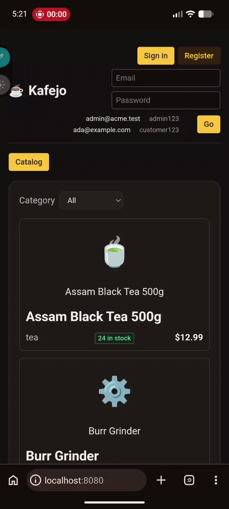
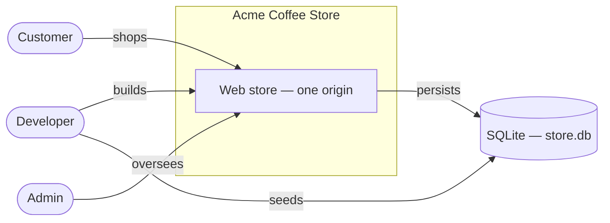
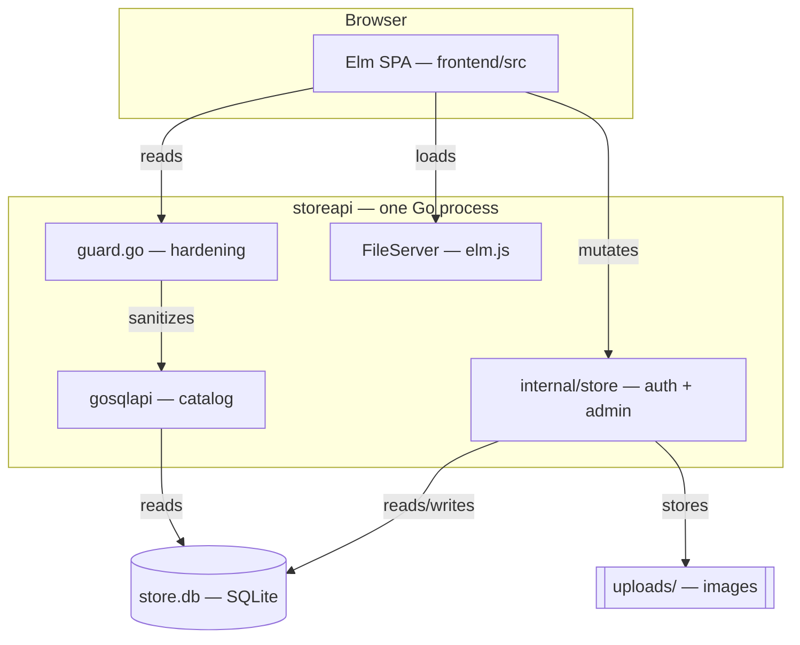
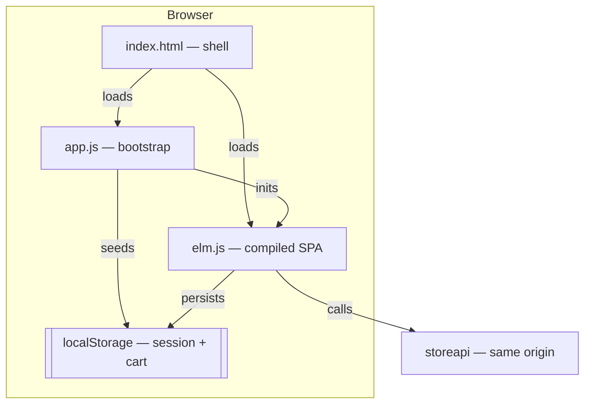
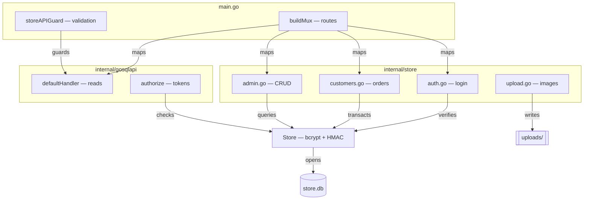
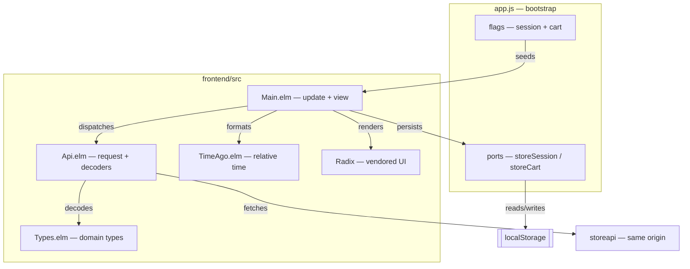
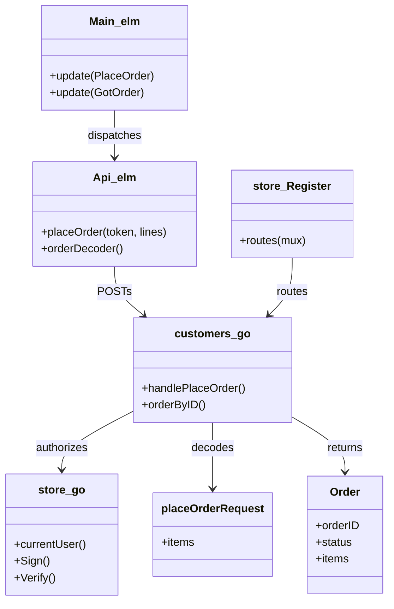

# Kafejo - Your own online coffee store!


## Architecture (C4)

### Level 1 — System context



### Level 2 — Containers



### Level 2 — Containers (frontend)



### Level 3 — Components (storeapi)



### Level 3 — Components (frontend)



### Level 4 — Code (place an order)



A small end-to-end example: a Go REST API that also serves an Elm single-page
frontend, from **one process on one origin**.

- `api/` — Go module `acme/storeapi`, wrapping the vendored `gosqlapi` engine.
  It serves the JSON API under `/store/...`, a custom auth/customer/admin API
  (`api/internal/store`), and the static frontend at `/`.
- `frontend/` — Elm 0.19.3 SPA (`src/`), compiled to `elm.js` and loaded by
  `frontend/index.html`.
- `gosqlapi/` — upstream library (its own git repo); the API embeds a copy under
  `api/internal/gosqlapi`.

## Requirements

- Go 1.27+
- Elm 0.19.3, `elm-test` (elm-test-rs), and a JS runtime for the tests
- Termux/aarch64: these need the proot setup described in `AGENTS.md`; the
  `make` targets handle it.

## Quick start

```sh
make build     # build api/storeapi and frontend/elm.js
make run       # serve API + frontend on http://127.0.0.1:8080/
make db-init   # (first run) create + seed the SQLite schema
```

Open <http://127.0.0.1:8080/>. The frontend talks to the API on the **same
origin** (`baseUrl = ""` in `frontend/src/Api.elm`), so no CORS or host
configuration is needed.

Sign in with one of the seeded accounts (or register a new customer):

| Role | Email | Password |
| --- | --- | --- |
| Admin | `admin@acme.test` | `admin123` |
| Customer | `ada@example.com` | `customer123` |

Passwords are bcrypt-hashed in `CUSTOMERS.PASSWORD_HASH`; sessions are
HMAC-signed tokens kept in browser storage and sent as `Authorization: Bearer`.
Set `auth.secret` in `api/gosqlapi.json` for anything beyond local dev.

## Make targets

| Target | Description |
| --- | --- |
| `make build` | Build `api/storeapi` and `frontend/elm.js` |
| `make run` | Serve API + frontend on `127.0.0.1:8080` |
| `make db-init` | Create + seed the SQLite schema (`storeapi -seed`, local only) |
| `make frontend` | Rebuild `elm.js` only (proot recipe) |
| `make test` | Run `test-go` and `test-frontend` |
| `make test-go` | `go test ./...` in `api/` |
| `make test-frontend` | `elm-test` in `frontend/` |
| `make review` | Lint the frontend with `elm-review` (via `bun`) |
| `make check` | Run `test` and `review` |
| `make clean` | Remove the compiled `api/storeapi` binary |

Rebuild `elm.js` (`make frontend`) after editing anything in `frontend/src/`;
the Go server serves the compiled file, not the Elm source.

## API

Two layers share the same handler tree:

- **Catalog** (from `gosqlapi`): public reads under `/store/...`.
- **Auth / customer / admin** (from `api/internal/store`): email + password
  login and role-scoped operations. All of these require
  `Authorization: Bearer <token>` unless noted.

| Method | Path | Notes |
| --- | --- | --- |
| POST | `/auth/register` | Create a customer account, returns a token |
| POST | `/auth/login` | Sign in, returns a token + user |
| GET | `/auth/me` | Current user |
| GET | `/my/orders` | The caller's own orders |
| POST | `/my/orders` | Place an order (customer) |
| GET/POST | `/admin/products` | List / create products (admin) |
| PUT/DELETE | `/admin/products/{sku}` | Update / delete a product (admin) |
| GET | `/admin/orders`, PUT `/admin/orders/{id}` | List orders / set status |
| GET | `/admin/customers`, PUT/DELETE `/admin/customers/{id}` | Manage customers |
| GET | `/admin/revenue` | Revenue by category (admin) |
| GET | `/admin/signups` | New users: today / 7 / 30 / 90 days (admin) |
| POST | `/admin/uploads` | Upload a product image (admin, ≤ 5 MB, png/jpeg/gif/webp/svg) |
| GET | `/store/products`, `/store/products/{sku}` | Public catalog (active products only) |
| GET | `/store/low_stock` | Public low-stock report |
| GET | `/uploads/{file}` | Static product images (`api/uploads/`) |

Public `/store/...` list requests are hardened before reaching the engine
(`api/guard.go`): `.page_size` is capped at 100, malformed `.offset`/`.order_by`
return `400`, and any engine `5xx` is replaced with a generic error.


Configuration lives in `api/gosqlapi.json`: databases, tables, scripts, and the
`auth` section (signing secret, token TTL). The data is a single SQLite file,
`api/store.db`. There is no `tokens` block — only `public_read` tables (the
catalog) are reachable; privileged operations go through the custom
`/admin/*`, `/my/*`, `/auth/*` handlers.

Each table accepts a `filter` field — a SQL predicate ANDed onto every read —
and an optional `filterable_columns` allow-list for request-param filters. The
catalog uses them to expose active products only and to limit filtering to
`SKU`, `NAME`, `CATEGORY`:

```json
"products": {
  "name": "PRODUCTS", "primary_key": "SKU",
  "filter": "ACTIVE = 1",
  "filterable_columns": ["SKU", "NAME", "CATEGORY"], ...
}
```

Both are local extensions to the vendored `api/internal/gosqlapi` engine (the
upstream copy in `gosqlapi/` does not have them). The admin endpoints in
`api/internal/store` read the table directly, so admins still see inactive rows.
Seeding is local-only: `make db-init` runs `storeapi -seed`, not an HTTP route.

## Frontend

One sign-in box handles both roles; the tabs depend on who is signed in:

- **Catalog** — public product list with category filter and pagination; a detail
  modal. Signed-in customers can add to cart and place orders.
- **My Orders** — a customer's own order history (customer role).
- **Products / Orders / Customers** — create, edit and delete products; change
  order status; edit roles or delete customers (admin role).
- **Reports** — new-users, low-stock and revenue-by-category (admin role).

See `frontend/README.md` for Elm-specific details.

## Tests

`make test` runs both suites:

- **Go** (`make test-go`) — `api/internal/store/store_test.go` unit tests,
  `api/e2e_test.go` (boots the real mux with `httptest.NewServer` against a
  database seeded from `scripts/init.sql`, exercising the seeded logins and the
  customer/admin HTTP flow), and `api/contract_test.go`, which pins the exact
  JSON keys of every response the frontend decodes.
- **Elm** (`make test-frontend`) — `frontend/tests/Tests.elm` (`queryString`),
  `frontend/tests/TimeAgoTest.elm` (`TimeAgo` formatting),
  `frontend/tests/ApiTest.elm` (decoder contract tests for every endpoint the
  frontend consumes), and `frontend/tests/MainTest.elm` (`elm-program-test`
  render tests plus `update` logic for auth, cart, orders and admin actions).

`make review` additionally runs [`elm-review`](https://github.com/jfmengels/elm-review)
over `frontend/src` and `frontend/tests` using the config in `frontend/review/`
(the `application` starter template, with vendored `frontend/vendor/` excluded).
It must report no errors; `make check` runs it together with the test suites.

## Verifying

```sh
curl -s -o /dev/null -w '%{http_code}\n' http://127.0.0.1:8080/   # 200
curl -s http://127.0.0.1:8080/store/products                     # JSON
make test                                                         # Go + Elm
```

Project conventions for contributors and agents are in `AGENTS.md`.
